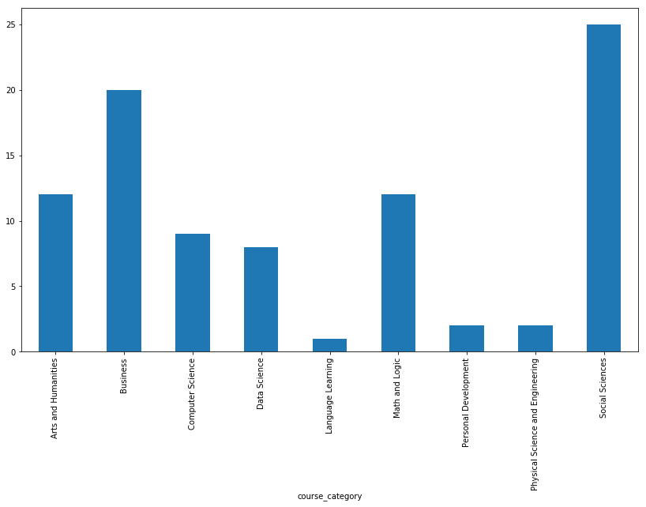
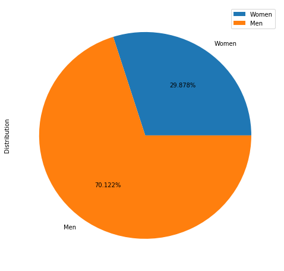
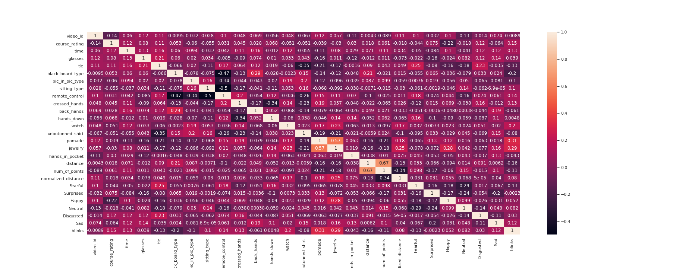
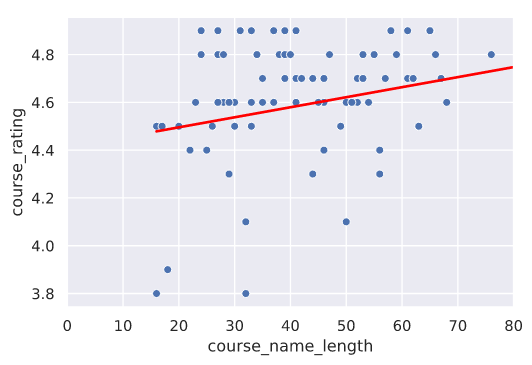

# coursera_hse_research
HSE Coursera Videos Analysis, Body Language Research : Regression, Correlation models

Higher School of Economics Courses on Coursera Distribution by Discipline

# Coursera_Research.ipynb - Pandas, Numpy, Matplotlib CSV Data Analysis and Visualization

# Folders contents:

- coursera_parser/ - Coursera parsers
  - courses_parser.py - Python Script for parsing Coursera online-courses for selected specific URL, in our case HSE University
  - extract_info.py - Python Script for iteratively extracting information for each course and then saving it into formatted CSV file
  - video_downloader.py - Python Script for iteratively downloading selected Coursera videos from the list, then executing FFmpeg on them in order to remove audiotrack and compress to .mp4 using libx264 code
  - videos folder - dataset of HSE courses videos, duration of 1 minute
- data/ - csv datasets folder
- emotion_detection/
  - emotion_detection.py - Python Script for detecting Emotions on image or video using OpenCV and model.h5
  - model.h5 - pretrained Tensorflow model for predictions
  - haarcascade_frontalface_default.xml - OpenCV Haar Cascade for face detection
  - results/ - folder with .txt data for each video emotions statistics
  - process_dataset.py - Script for grabbing .txt data and merging it into one csv
-gender_detection/
  - detect.py - Python Script for Predicting Gender of Person in Video or Image
  - gender_net.caffemodel - neural net pretrained model for predicting Gender
  - opencv_face_detector_uint8.pb - OpenCV face detector
- head_movement/
  - webcam.py - Python Script for calculating head movement distance
  - results/ - folder with .txt data for each video head movement statistics
  - process_dataset.py - Script for grabbing .txt data and merging it into one csv
  - haarcascade_frontalface_default.xml - OpenCV Haar Cascade for face detection
- realtime-glasses-detection/
  - eyeglass_detector.py - Python Script for Predicting Glasses on Image or Video
  - dlib - dlib library neccessary for eyeglass_detector

Higher School of Economics Courses on Coursera Lecturers Sex Distribution

Correlation Table Calculated

Sample Linear Regression Model

